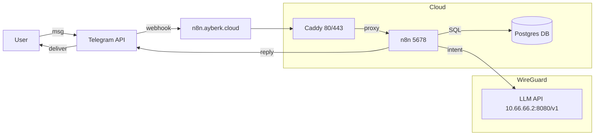
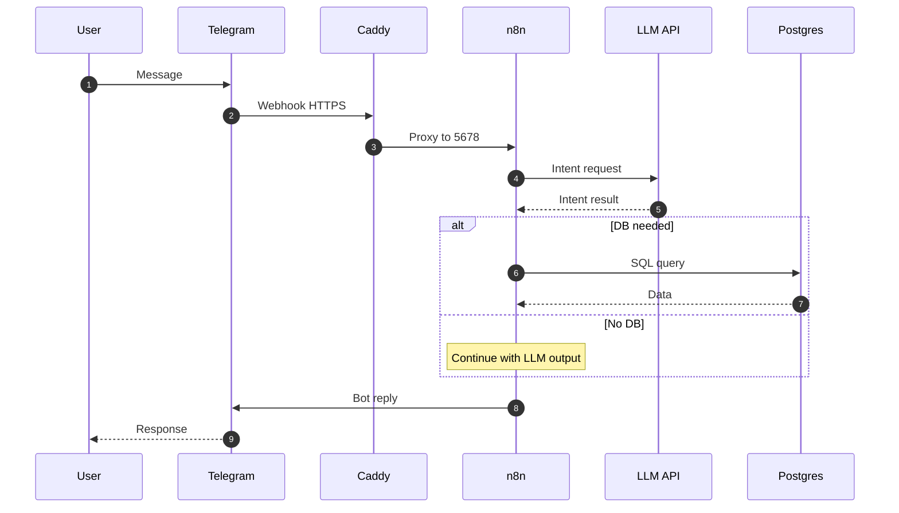

## 1) Topoloji

```mermaid
flowchart LR
    U[User]
    TG[Telegram API]
    DNS[n8n.ayberk.cloud]

    subgraph CLOUD[Cloud]
        CADDY[Caddy 80/443]
        N8N[n8n 5678]
        DB[(Postgres DB)]

        CADDY -->|proxy| N8N
        N8N -->|SQL| DB
    end

    subgraph VPN[WireGuard]
        LLM[LLM API 10.66.66.2:8080/v1]
    end

    U -->|msg| TG
    TG -->|webhook| DNS
    DNS --> CADDY
    N8N -->|intent| LLM
    N8N -->|reply| TG
    TG -->|deliver| U
```

## 2) Akış

```mermaid
sequenceDiagram
    autonumber
    participant U as User
    participant T as Telegram
    participant C as Caddy
    participant N as n8n
    participant L as LLM API
    participant P as Postgres

    U->>T: Message
    T->>C: Webhook HTTPS
    C->>N: Proxy to 5678

    N->>L: Intent request
    L-->>N: Intent result

    alt DB needed
        N->>P: SQL query
        P-->>N: Data
    else No DB
        Note over N: Continue with LLM output
    end

    N->>T: Bot reply
    T-->>U: Response
```
